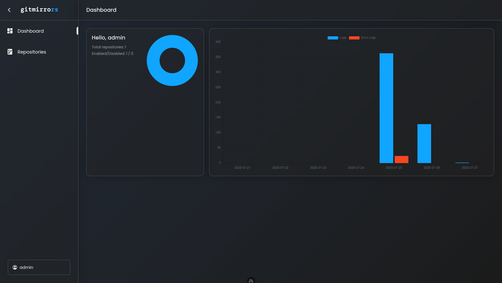
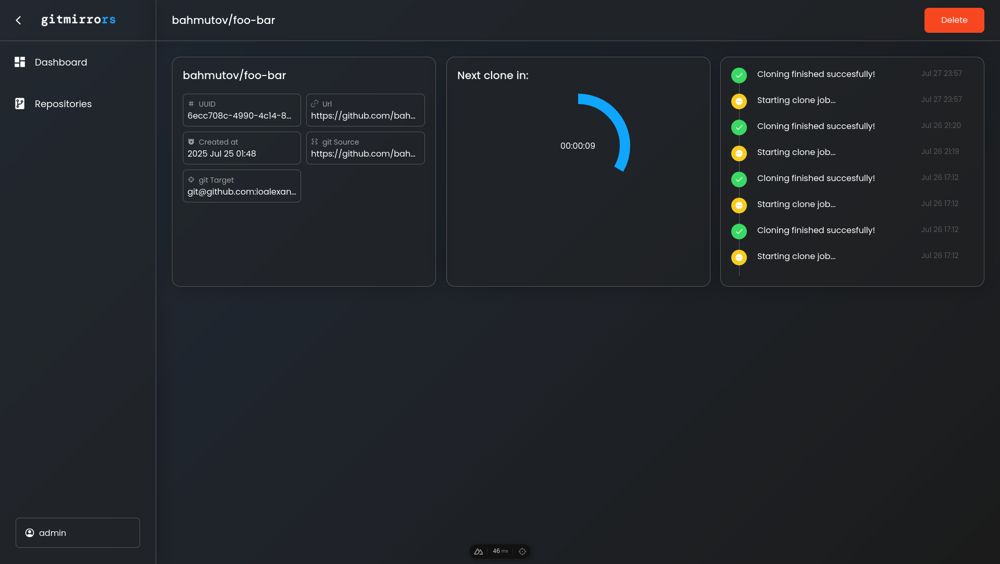
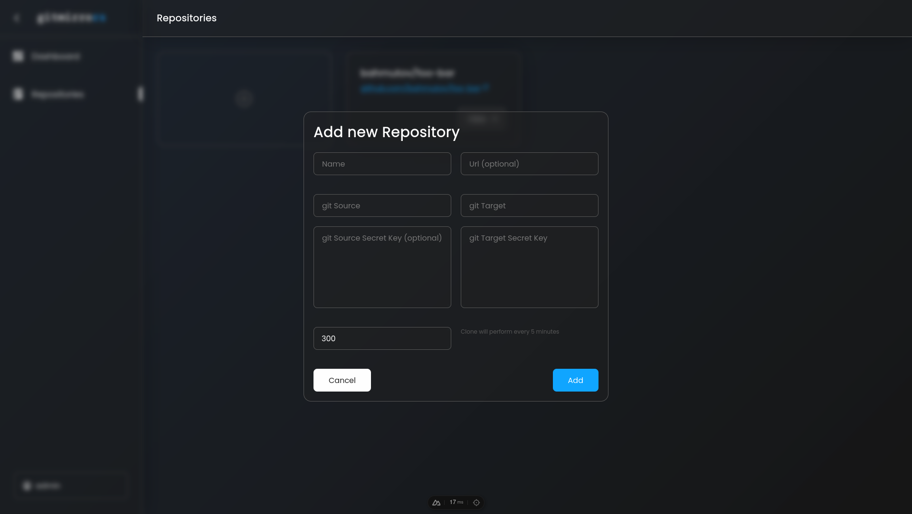
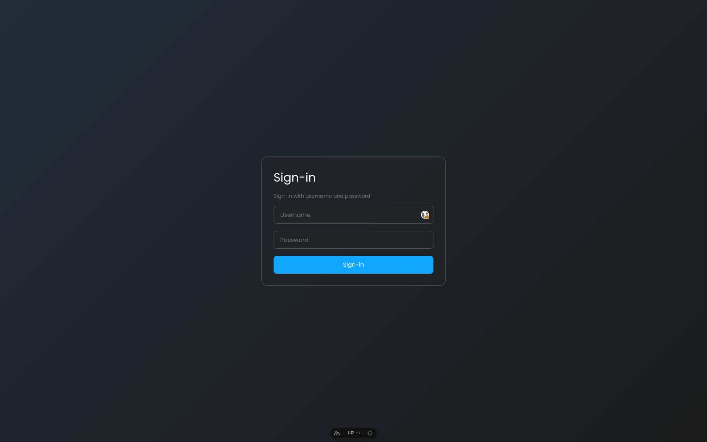

# GitMirrors - clone repositories automatically

GitMirrors is a self-hosted repository archiving tool that automatically clones and mirrors Git repositories on a schedule. Written in Rust and Nuxt;


## Screenshots:

<table>
  <tr>
    <td></td>
    <td></td>
  </tr>
  <tr>
    <td></td>
    <td></td>
  </tr>
</table>

## Running GitMirrors

```
git clone
```

```sh
cp .env.production .env
```

Fill the `.env` file.

Your `GID` and `UID` should be filled

```
docker-compose up --build
```

> **⚠️ Warning:** Right now, your git credentials are being stored in plain text, use only trusted instances!

## Develop GitMirrors

```
git clone
```

Fill the `.env` file.

Your `GID` and `UID` should be filled

```
docker-compose -f docker-compose.dev.yml up
```

## First login

Username: `admin`
Password: `any_random_string`

> **⚠️ Warning:** You should change the password after that. Otherwise, the password will still be any.

## Roadmap

- [x] basic functionality - repositories are being cloned
- [-] cleaning code base (e.g. linters, refactorings)
  - [x] linters
  - [ ] refactorings, de-dublications,
- [x] docker image building pipelines
- [ ] proper frontend logging
- [ ] fix randomly missing icons on frontend
- [ ] securely store git credentials
- [ ] pull repositories data
- [ ] advanced input validation
- [ ] users management
- [ ] mobile version (right now it's still usable, but I still want to fix sidebar)
